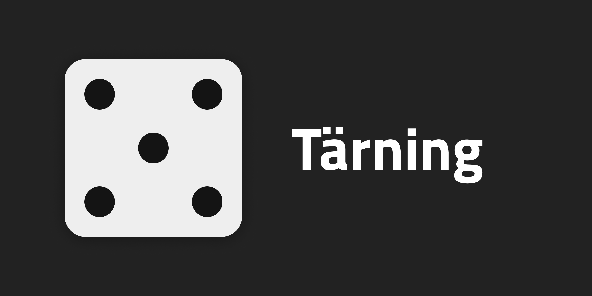

# Övningar på temat TypeScript

## Skriv om dina gamla projekt till typeSCript

## Uppvärmning

### en tärning

Skapa ett objekt med egenskapen `sides` metoden `throw()` som slumpar ett tal mellan 1 och `sides`. Din tärning kan innehålla allt ifrån 6 till 24 sidor.

### Visa dem i browsern

Slå 5st tärningar och visa dem grafiskt i webbläsaren med HTML och CSS, inga bilder!

### Slumpen-testet

Slå tärningen 10 000 ggr. Hur ser slagfördelningen ut 1 - 6? Visas i `bodyn`. Alt. med diagram från [charts.js](https://www.chartjs.org/) el. dyl.

## Tärningsspel

### Stegen

Gör ett tärningspel där användaren ska kasta 1st tärning. Vid första kastet ska målet vara 1. Om 1 ej fås, ska man försöka igen. Hur många kast tar det för att komma upp i en stege, 1,2,3,4,5,6? Kast räknas och den med lägst antal kast vinner.

Visa med snyggt gränssnitt.

### Knock out

- Spelet har 2st tärningar.
- Du som spelare väljer ett “knock out number” – antingen 6, 7, 8, eller 9.
- Spelaren kastar båda tärningarna. Anteckna varje kasts resultat.
- Om spelaren kastar något utav "knock out numbers" ges minuspoäng

Vinner gör man antingen på högst poäng på 1 minut, alt. högst poäng efter N knock outs.

Visa med vackert gränssnitt gjord med HTML och CSS.

### Going to Boston

Spelet har 3st tärningar.

1. Kasta tärningarna och spara tärningen med högsta värdet.

2. Kasta de kvarvarande 2 och spara tärningen med högsta värdet.

3. Kasta sista tärningen och summera samtliga tre tärningar.

Spelaren med högst summerat värde vinner. Max poäng är 18.

Visa med vackert gränssnitt gjord med HTML och CSS.
